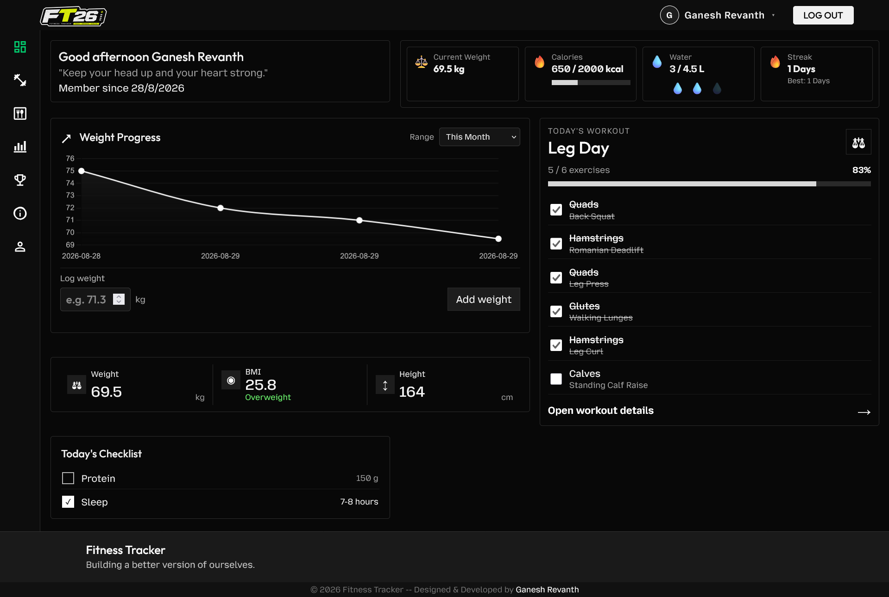

# Fitness Tracker

A clean, modern fitness tracking web app built to help users stay consistent, log workouts, and monitor daily health habits.

<p align="center">
  
  
  
</p>

## Overview

Fitness Tracker is a personal training companion designed for users who want to build discipline, stay accountable, and keep a structured record of their progress.

The project combines a polished landing page, user authentication, and a dashboard experience for tracking workouts, daily tasks, and routine consistency. It is built using vanilla JavaScript and Firebase, making it a great example of a lightweight full-stack web app.

## Why this project

This app is aimed at people who want a simple but motivating way to:

- track workout streaks
- log daily fitness routines
- stay consistent with their plan
- manage personal health habits in one place

## Features

- Responsive fitness themed landing page
- User signup and login flow
- Firebase Authentication integration
- Dashboard with training-focused UI
- Daily checklist for habits and exercise preparation
- Workout tracking and completion progress
- Firestore-backed persistence for user data
- Mobile-friendly responsive layout
- Local fallback storage for smoother offline usage

## Tech Stack

- HTML5
- CSS3
- JavaScript (ES Modules)
- Firebase Authentication
- Cloud Firestore
- LocalStorage fallback

## Project Structure

```bash
.
├── 404.html
├── assets/
├── dashboard.html
├── dashboard.js
├── firebase.js
├── index.html
├── index.js
├── login.html
├── login.js
├── notifications.js
├── README.md
├── signup.html
├── signup.js
├── style.css
└── workouts.js
```

## Screenshots

Here are a few views from the app to give GitHub visitors a better sense of the product experience.

### Dashboard



### Login screen


### Progress tracking


### Settings page


## Getting Started

### Prerequisites

Before running the app, make sure you have:

- A browser such as Chrome or Edge
- A Firebase project
- Firebase Authentication enabled
- Firestore Database enabled

### 1. Clone the repository

```bash
git clone https://github.com/your-username/fitness-tracker.git
cd fitness-tracker
```

### 2. Configure Firebase

1. Create a Firebase project in the Firebase Console.
2. Enable Authentication.
3. Enable Cloud Firestore.
4. Copy your web app configuration.
5. Replace the configuration inside `firebase.js` from provided Firebase's preset.

### 3. Run locally

The project is browser-based, so the easiest way to run it is with a local web server.

#### Option 1: VS Code Live Server

- Open the project in VS Code
- Right-click `index.html`
- Select "Open with Live Server"

#### Option 2: Python local server

```bash
python -m http.server 8000
```

Then open:

```text
http://localhost:8000
```

## Usage

1. Open the app in the browser.
2. Create an account or log in.
3. Access the dashboard after authentication.
4. Track workouts and daily checklist items.
5. Continue tracking your fitness over time.

## Current Status

This project is currently in active development and already includes the core foundation for a functional fitness tracker.

## Roadmap

Planned improvements include:

- workout history and analytics
- progress charts for weight and performance
- user profile customization
- goal setting and milestone tracking
- stronger mobile UX polish
- real-time insights and dashboard expansion

## Contributing

Contributions are welcome.

1. Fork the repository
2. Create your feature branch
3. Commit your changes
4. Push to your branch
5. Open a pull request

## License

This project is licensed under the MIT License. See the [LICENSE](LICENSE) file for details.

## Author

Built with a focus on consistency, discipline, and long-term progress.

---
